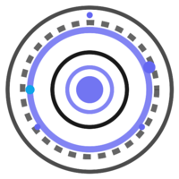

# Galileo Glass UI

<div align="center">
  
  <p><em>Modern glass morphism UI components for React, Next.js, and any TypeScript application</em></p>
  <!-- 💡 Add GIF showcasing main UI features and effects here! 💡 -->
  <p>
    <a href="https://www.npmjs.com/package/@veerone/galileo-glass-ui"></a>
    <a href="https://github.com/VeerOneGPT/galileo-glass-ui"></a>
    <a href="https://github.com/VeerOneGPT/galileo-glass-ui/blob/main/LICENSE"></a>
  </p>
</div>

**Galileo Glass UI** is more than just a component library; it's a complete framework for building stunning, modern web applications with a unique **glass morphism** aesthetic. Blend beautiful visual effects with a powerful, integrated **physics-based animation system** to create interfaces that feel alive and intuitive.

Built with **React 18/19, TypeScript, and Styled Components**, Galileo provides a comprehensive set of **accessible, performant, and highly customizable** components designed to elevate your user experience.

---

## ✨ Why Galileo Glass UI?

*   **Unique Aesthetic:** Stand out with sophisticated glass morphism styling, complete with configurable blurs, reflections, glows, and dynamic transparency.
*   **Dynamic Interactions:** Go beyond static interfaces. Leverage the integrated physics engine and intuitive hooks (`usePhysicsInteraction`, `useMagneticElement`, `useGesturePhysics`) to create engaging, natural-feeling user experiences.
*   **Performant Animations:** Achieve smooth, 60fps animations thanks to a purpose-built system that replaces heavy dependencies and adapts to user device capabilities.
*   **Orchestration Power:** Easily create complex, coordinated animation sequences with `useAnimationSequence` for delightful entrances, exits, and state transitions.
*   **Accessibility Baked In:** Deliver inclusive experiences with fine-grained reduced motion controls, high-contrast adaptations, and full keyboard support.
*   **Developer Experience:** Enjoy a fully typed API, extensive documentation, flexible customization options, and optimized bundling.

---

## 🚀 Key Features

- ✨ **Glass Morphism Styling**: Configurable frosted glass effects, reflections, shadows, inner/outer glows, and adaptive transparency.
- 📦 **Comprehensive Component Library**: 90+ components including specialized Glass versions (e.g., `GlassButton`, `GlassCard`, `GlassTabs`, `GlassDataChart`). See list below.
- 🚀 **Advanced Physics-Based Animation System**:
    - Integrated Physics Engine: Springs, collisions, forces, object sleeping.
    - Intuitive Hooks: `usePhysicsInteraction`, `useGalileoStateSpring`, `useMultiSpring`, `useGesturePhysics`, `useMagneticElement` for common UI interactions.
    - **New (v1.0.8):** Lower-level `useGalileoPhysicsEngine` hook for direct engine access and custom simulations.
    - Orchestration: `useAnimationSequence` for complex sequences & staggering.
    - Specialized Effects: Z-space, 3D transforms, parallax, particles.
    - Performance: GPU-accelerated, adaptive quality, replaces CSS/Framer Motion.
- ♿ **Accessibility-First Design**: Configurable `useReducedMotion`, sensitivity levels, animation categories, high contrast support, keyboard navigation, focus management.
- ⚡ **Performance Optimized**: Adaptive quality (`useQualityTier`), style caching, GPU acceleration, animation batching (`DomBatcher`).
- 📦 **Bundle Optimization**: Fine-grained imports (`/components`, `/hooks`, `/animations`, etc.), `slim` bundle, tree-shaking.
- 🎨 **Extensive Customization**: Powerful mixins (`glassSurface`, `glassGlow`, `zSpaceLayer`) & flexible `ThemeProvider`.
- ⚙️ **Modern Tech Stack**: React 18/19, TypeScript 4.9+, Styled Components 5/6.
- 🧪 **Tested & Reliable**: Comprehensive Jest & RTL test coverage.

---

## 🚀 Getting Started

### Installation

<div align="center">
  <table>
    <tr>
      <th>NPM (Recommended)</th>
      <th>Next.js Projects</th>
      <th>Other Package Managers</th>
      <th>GitHub (Development)</th>
    </tr>
    <tr>
      <td>
        
```bash
# Install from NPM (recommended)
npm install @veerone/galileo-glass-ui styled-components
```
      </td>
      <td>
        
```bash
# Install in Next.js project
npm install @veerone/galileo-glass-ui styled-components

# In next.config.js:
transpilePackages: ['@veerone/galileo-glass-ui']
```
      </td>
      <td>
        
```bash
# For yarn
yarn add @veerone/galileo-glass-ui styled-components

# For pnpm
pnpm add @veerone/galileo-glass-ui styled-components
```
      </td>
      <td>
        
```bash
# Install from GitHub repository
npm install github:VeerOneGPT/galileo-glass-ui styled-components
```
      </td>
    </tr>
  </table>
</div>

#### What's New in v1.0.6

Version 1.0.6 includes the major features originally planned for 1.0.5, plus critical build fixes.

##### ✨ Comprehensive Animation System Overhaul
- **Integrated Physics Engine:** Introduced a completely redesigned, powerful physics engine (`galileoPhysicsSystem.ts`) powering all animations. Features highly configurable spring physics, advanced collision detection, global forces, and performance optimizations like object sleeping.
- **New Interaction & State Hooks:** Added intuitive hooks like `usePhysicsInteraction` (for rich hover/press feedback), `useGalileoStateSpring` (animating single values), `useMultiSpring` (animating vectors/transforms), and `useGesturePhysics` (natural gesture responses with inertia).
- **Animation Orchestration:** `useAnimationSequence` enables complex, precisely timed animation sequences with dependencies, staggering, grouping, and lifecycle control.
- **Advanced Accessibility:** Enhanced `useReducedMotion` provides fine-grained control with sensitivity levels, animation categories, and alternative animation preferences.
- **Specialized Effects:** Includes hooks and utilities for Z-space management (`useZSpace`), 3D transforms (`use3DTransform`), parallax, particle systems, and more.
- **Unified System:** Replaces previous CSS transitions and external libraries (like Framer Motion) for a consistent, performant, and integrated animation experience across the library.
- **Context & Configuration:** `AnimationProvider` and `useAnimationContext` allow global configuration of animation defaults and presets.

##### 🆕 New Components
- **GlassCardLink:** An interactive card designed for navigation, featuring enhanced 3D perspective transforms, physics-based hover effects, and interactive lighting.
- **GlassTabs:** Glass-morphism styled tabs with an animated active indicator, physics-inspired transitions, and full keyboard accessibility.
- **ChartWrapper:** A lightweight, styled container for embedding chart components consistently within the Glass UI aesthetic.

##### 📊 Enhanced Charting & Data
- **ModularGlassDataChart Architecture:** Refactored `GlassDataChart` into smaller, maintainable components (`ChartRenderer`, `ChartTooltip`, `KpiChart`, `AtmosphericEffects`, etc.).
- **Adaptive Quality:** Charts automatically adjust rendering quality and animation fidelity based on device capabilities.

##### ✅ React 19 Compatibility & TypeScript Improvements
- **Full React 19 Support:** Ensured compatibility with React's latest features and type checking.
- **Enhanced Refs & Types:** Implemented proper `forwardRef` usage, defined ref interfaces (`GlassDataChartRef`), and improved overall type safety and null-checking.
- **Build Fix:** Resolved critical build errors related to invalid TypeScript declaration (`.d.ts`) generation, ensuring compatibility with consuming projects.

##### Optional Feature Dependencies

Galileo Glass UI uses a modular approach where specialized features only require their dependencies when you use them:

```bash
# Only if using chart components (BarChart, LineChart, etc.)
npm install chart.js react-chartjs-2

# Only if using virtualized lists
npm install react-window
```

This keeps your bundle size small by only including what you need!

> **Important**: For detailed installation instructions, see our installation guides:
> - [Complete Installation Guide](./docs/installation/INSTALLATION.md) - Full installation options
> - [NPM Package Reference](https://www.npmjs.com/package/@veerone/galileo-glass-ui) - Using the NPM package
> - [Bundle Optimization Guide](./docs/performance/optimization/bundle-optimization.md) - Optimizing your bundle size

### Basic Usage

```jsx
import React from 'react';
import { ThemeProvider, Button, Card, Typography } from '@veerone/galileo-glass-ui';
import styled from 'styled-components';

function App() {
  return (
    <ThemeProvider>
      <Card glass>
        <Typography variant="h4">Galileo Glass UI</Typography>
        <Typography variant="body1">
          Modern, beautiful UI components with glass morphism styling.
        </Typography>
        <Button variant="contained" glass>
          Get Started
        </Button>
      </Card>
    </ThemeProvider>
  );
}

export default App;
```

### Next.js Integration

```jsx
// pages/_app.js or app/layout.js
import { ThemeProvider } from '@veerone/galileo-glass-ui';

export default function MyApp({ Component, pageProps }) {
  return (
    <ThemeProvider>
      <Component {...pageProps} />
    </ThemeProvider>
  );
}
```

```jsx
// Any Next.js page or component
import { Card, Button, Typography } from '@veerone/galileo-glass-ui';

export default function HomePage() {
  return (
    <Card glass>
      <Typography variant="h4">Welcome to Next.js with Galileo Glass</Typography>
      <Typography variant="body1">
        Beautiful glass morphism styling in your Next.js application.
      </Typography>
      <Button variant="contained" glass>
        Explore
      </Button>
    </Card>
  );
}
```

### Optimized Imports

Galileo Glass UI now supports multiple import patterns for optimal bundle size:

```jsx
// Option 1: Slim bundle with essential components only (smallest bundle size)
import { Button, Card, Typography, ThemeProvider } from '@veerone/galileo-glass-ui/slim';

// Option 2: Direct component imports (optimal tree-shaking)
import { Button } from '@veerone/galileo-glass-ui/components/Button';
import { Card } from '@veerone/galileo-glass-ui/components/Card';
import { ThemeProvider } from '@veerone/galileo-glass-ui/theme';

// Option 3: Domain-specific imports
import { accessibleAnimation } from '@veerone/galileo-glass-ui/animations';
import { glassSurface, glassGlow } from '@veerone/galileo-glass-ui/core';
import { usePhysicsInteraction } from '@veerone/galileo-glass-ui/hooks';
```

<details>
<summary><strong>🎬 Live Demo / Examples</strong></summary>
<!-- 💡 Add link to Storybook or deployed examples site here! 💡 -->
Check out our [interactive examples](https://github.com/VeerOneGPT/galileo-glass-ui/blob/main/examples/README.md) to see Galileo Glass UI in action!

</details>

---

## 📋 Documentation

<div align="center">
  <table>
    <tr>
      <th>📚 Core Docs</th>
      <th>🎨 Styling</th>
      <th>🔄 Animation System</th>
      <th>⚙️ Physics Engine</th>
      <th>📊 Advanced Features</th>
      <th>🏗️ Development</th>
    </tr>
    <tr>
      <td><a href="./docs/core/framework-guide.md">Framework Guide</a></td>
      <td><a href="./docs/core/framework-guide.md#glass-surface-system">Glass Surfaces</a></td>
      <td><a href="./docs/animations/physics-hooks.md">Core Physics Hooks</a></td>
      <td></td>
      <td><a href="./docs/components/glass-charts.md">Chart Components</a></td>
      <td><a href="./docs/core/project-structure.md">Package Architecture</a></td>
    </tr>
    <tr>
      <td><a href="./docs/core/theme-system.md">Theme System</a></td>
      <td><a href="./docs/core/framework-guide.md#z-space-layering">Z-Space Layering</a></td>
      <td><a href="./docs/animations/orchestration.md">Sequence Orchestration</a></td>
      <td></td>
      <td><a href="./docs/components/specialized-surfaces.md">Specialized Surfaces</a></td>
      <td><a href="./docs/performance/optimization/optimization-techniques.md">Optimization Techniques</a></td>
    </tr>
    <tr>
      <td><a href="./docs/components/advanced-components.md">Advanced Components</a></td>
      <td><a href="./docs/core/framework-guide.md#common-patterns">Common Patterns</a></td>
      <td><a href="./docs/animations/context-config.md">Context & Configuration</a></td>
      <td><a href="./docs/physics/engine-api.md">Engine API (WIP)</a></td> 
      <td>{/* Removed Legacy Physics Link */}</td> 
      <td><a href="./docs/development/component-patterns.md">Component Patterns</a></td>
    </tr>
    <tr>
      <td><a href="./INSTALLATION.md">Installation Guide</a></td>
      <td><a href="./docs/components/TROUBLESHOOTING.md">Troubleshooting</a></td>
      <td><a href="./docs/animations/accessibility.md">Accessibility</a></td> 
      <td></td>
      <td><a href="./docs/development/implementation-status.md">Implementation Status</a></td>
      <td><a href="./docs/performance/optimization/memoization-patterns.md">Memoization Patterns</a></td>
    </tr>
    <tr>
      <td></td>
      <td></td>
      <td>{/* Removed WIP Transition Hooks Link */}</td>
      <td></td>
      <td><a href="./docs/development/implementation-notes.md">Implementation Notes</a></td>
    </tr>
  </table>
</div>

---

## ⚠️ Critical Implementation Requirements

<details open>
<summary><b>1. CSS Property Naming in Styled Components</b></summary>
<br>

> **ALWAYS use kebab-case (not camelCase) for CSS properties in styled-components template literals:**
>
> ```tsx
> // ✅ CORRECT: Use kebab-case for CSS properties
> const Component = styled.div`
>   background-color: rgba(255, 255, 255, 0.1);  // ✅ Correct!
>   backdrop-filter: blur(10px);                // ✅ Correct!
>   border-radius: 8px;                         // ✅ Correct!
> `;
> 
> // ❌ INCORRECT: Will cause runtime errors!
> const Component = styled.div`
>   backgroundColor: rgba(255, 255, 255, 0.1);  // ❌ Wrong!
>   backdropFilter: blur(10px);                // ❌ Wrong!
>   borderRadius: 8px;                         // ❌ Wrong!
> `;
> ```
>
> > **Note**: Use camelCase only for inline styles: `<div style={{ backgroundColor: 'red' }} />`

</details>

<details open>
<summary><b>2. Always Pass Theme Context to Glass Mixins</b></summary>
<br>

> **ALWAYS pass themeContext to glass mixins:**
>
> ```tsx
> // ✅ CORRECT: Pass themeContext to glass mixins
> import { glassSurface } from '@veerone/galileo-glass-ui/mixins';
> import { createThemeContext } from '@veerone/galileo-glass-ui/core';
> 
> const GlassComponent = styled.div`
>   ${props => glassSurface({
>     elevation: 2,
>     blurStrength: 'standard',
>     themeContext: createThemeContext(props.theme) // ✅ Important!
>   })}
> `;
> ```
>
> > **Why?** The theme context provides color mode, variant, and other critical styling information

</details>

For a complete implementation guide, see the [Glass UI Framework Documentation](./docs/core/framework-guide.md).

---

## 📦 Component Library

Galileo Glass UI offers a comprehensive set of components that work universally across React, Next.js, and TypeScript applications:
<!-- 💡 Add GIF showcasing component variety here! 💡 -->

<div align="center">
  <table>
    <tr>
      <th align="center">🧩 Layout</th>
      <th align="center">🔤 Typography</th>
      <th align="center">🎛️ Input</th>
      <th align="center">🧭 Navigation</th>
    </tr>
    <tr valign="top">
      <td>
        <ul>
          <li>Box</li>
          <li>Container</li>
          <li>Paper</li>
          <li>Grid</li>
          <li>Stack</li>
          <li>Divider</li>
          <li>GlassMasonry</li>
        </ul>
      </td>
      <td>
        <ul>
          <li>Typography</li>
          <li>Link</li>
        </ul>
      </td>
      <td>
        <ul>
          <li>Button / GlassButton</li>
          <li>MagneticButton</li>
          <li>TextField</li>
          <li>Checkbox</li>
          <li>Radio</li>
          <li>Switch / GlassSwitch</li>
          <li>Select</li>
          <li>Slider</li>
          <li>Autocomplete</li>
          <li>DatePicker / GlassDatePicker</li>
          <li>GlassDateRangePicker</li>
          <li>GlassMultiSelect</li>
          <li>TagInput</li>
          <li>ToggleButton</li>
          <li>Rating</li>
          <li>FormControl</li>
          <li>FormGroup</li>
          <li>FormLabel</li>
          <li>FormHelperText</li>
        </ul>
      </td>
      <td>
        <ul>
          <li>Tabs / GlassTabs</li>
          <li>Pagination</li>
          <li>BottomNavigation</li>
          <li>Accordion</li>
          <li>SpeedDial</li>
          <li>TreeView</li>
          <li>Breadcrumbs / GlassBreadcrumbs</li>
          <li>Menu / GlassMenu</li>
          <li>MenuItem</li>
          <li>Toolbar</li>
          <li>GlassNavigation</li>
          <li>GlassTabBar</li>
          <li>GlassCarousel</li>
          <li>PageTransition</li>
          <li>ZSpaceAppLayout</li>
          <li>GlassTimeline</li>
          <li>GlassCardLink</li> 
        </ul>
      </td>
    </tr>
    <tr>
      <th align="center">📱 Feedback</th>
      <th align="center">📊 Data Display</th>
      <th align="center">🛠️ Utility</th>
      <th align="center">📈 Charts & Specialized</th>
    </tr>
    <tr valign="top">
      <td>
        <ul>
          <li>Alert</li>
          <li>Progress</li>
          <li>Dialog / GlassDialog</li>
          <li>Snackbar</li>
          <li>Loader</li>
          <li>Skeleton</li>
          <li>VisualFeedback</li>
          <li>RippleButton</li>
          <li>FocusIndicator</li>
          <li>StateIndicator</li>
          <li>CookieConsent</li>
          <li>GlobalCookieConsent</li>
          <li>CompactCookieNotice</li>
        </ul>
      </td>
      <td>
        <ul>
          <li>Card / GlassCard</li>
          <li>Table</li>
          <li>List</li>
          <li>Chip</li>
          <li>Avatar</li>
          <li>Badge</li>
          <li>ImageList</li>
          <li>ImageListItem</li>
          <li>ImageListItemBar</li>
          <li>KpiCard</li>
          <li>PerformanceMetricCard</li>
          <li>InteractiveKpiCard</li>
        </ul>
      </td>
      <td>
        <ul>
          <li>Backdrop</li>
          <li>Modal / GlassModal</li>
          <li>Drawer</li>
          <li>Tooltip / GlassTooltip</li>
          <li>Icon</li>
          <li>Fab</li>
          <li>GlassThemeSwitcher</li>
          <li>GlassThemeDemo</li>
          <li>ThemedGlassComponents</li>
          <li>PerformanceMonitor</li>
          <li>OptimizedGlassContainer</li>
          <li>DynamicAtmosphere</li>
          <li>GlassLocalizationProvider</li>
          <li>AccessibilityProvider</li>
          <li>AccessibilitySettings</li>
          <li>GlassImageViewer</li>
        </ul>
      </td>
      <td>
        <ul>
          <li>ChartWrapper</li>
          <li>BarChart</li>
          <li>LineChart</li>
          <li>AreaChart</li>
          <li>PieChart</li>
          <li>GlassChart</li>
          <li>GlassDataChart</li>
          <li>DimensionalGlass</li>
          <li>HeatGlass</li>
          <li>FrostedGlass</li>
          <li>PageGlassContainer</li>
          <li>WidgetGlass</li>
          <li>AtmosphericBackground</li>
          <li>ParticleBackground</li>
          <li>ContextAwareGlass</li>
        </ul>
      </td>
    </tr>
  </table>
</div>

---

## 🧩 Code Examples

<details open>
<summary><b>🎭 Glass Card with Hover Effects</b></summary>
<br>
<!-- 💡 Add GIF for Glass Card Hover effect here! 💡 -->

```jsx
import { styled } from 'styled-components';
import { Box } from '@veerone/galileo-glass-ui';
import { glassSurface, glassGlow, innerGlow } from '@veerone/galileo-glass-ui/mixins';
import { createThemeContext } from '@veerone/galileo-glass-ui/core';

const GlassCard = styled(Box)`
  ${props => glassSurface({
    elevation: 2,
    blurStrength: 'standard',
    borderOpacity: 'medium',
    themeContext: createThemeContext(props.theme)
  })}
  
  padding: 24px;
  border-radius: 12px;
  
  &:hover {
    ${props => glassGlow({
      intensity: 'medium',
      color: 'primary',
      themeContext: createThemeContext(props.theme)
    })}
  }
  
  ${props => innerGlow({
    color: 'primary',
    intensity: 'subtle',
    spread: 10,
    themeContext: createThemeContext(props.theme)
  })}
`;
```
</details>

<details>
<summary><b>🔄 Accessible Animations</b></summary>
<br>

```jsx
import { styled } from 'styled-components';
import { accessibleAnimation } from '@veerone/galileo-glass-ui/animations';
import { fadeIn } from '@veerone/galileo-glass-ui/animations/keyframes'; // Corrected path

const AnimatedComponent = styled.div`
  ${props => accessibleAnimation({
    animation: fadeIn,
    duration: 0.3,
    easing: 'ease-out'
    // No need to manually check prefers-reduced-motion here
  })}
`;
```

> **Accessibility**: This animation automatically respects the user's `prefers-reduced-motion` settings via the `accessibleAnimation` utility.
</details>

<details>
<summary><b>🌎 Z-Space Layering</b></summary>
<br>

```jsx
import { styled } from 'styled-components';
import { zSpaceLayer } from '@veerone/galileo-glass-ui/mixins';
import { createThemeContext } from '@veerone/galileo-glass-ui/core';

const OverlayComponent = styled.div`
  ${props => zSpaceLayer({
    layer: 'OVERLAY', // Use predefined ZLayer enum for consistency
    position: 'fixed', // Example position
    depth: 3,
    themeContext: createThemeContext(props.theme)
  })}
`;
```

> **Z-Space** creates meaningful depth in interfaces by controlling elevation and visual hierarchy using predefined layers.
</details>

<details>
<summary><b>🧲 Physics Interactions (Magnetic Effect)</b></summary>
<br>
<!-- 💡 Add GIF for Magnetic Button interaction here! 💡 -->

```jsx
import { useRef } from 'react';
import { useMagneticElement } from '@veerone/galileo-glass-ui/hooks'; // Correct hook import

function MagneticButton() {
  const elementRef = useRef<HTMLButtonElement>(null);
  const { style, eventHandlers } = useMagneticElement({ // Use the specific hook
    elementRef,
    options: {
      strength: 0.5, // Attraction force
      radius: 100,   // Activation distance
      easeFactor: 0.8 // Smoothness
    }
  });
  
  return (
    <button 
      ref={elementRef} 
      style={style} // Apply the dynamic style from the hook
      {...eventHandlers} // Attach pointer event handlers
    >
      Magnetic Button
    </button>
  );
}
```

> **Magnetic Interactions** create natural-feeling UI elements that respond to user movements using hooks like `useMagneticElement`.
</details>

<details>
<summary><b>🎶 Animation Orchestration (Staggered List)</b></summary>
<br>
<!-- 💡 Add GIF for Staggered List entrance animation here! 💡 -->

```jsx
import React, { useRef, useEffect } from 'react';
import { styled } from 'styled-components';
import { useSequence, type UseSequenceParams } from '@veerone/galileo-glass-ui/hooks'; // Corrected import
import { Box } from '@veerone/galileo-glass-ui'; // Assuming Box component exists

const items = ['Item 1', 'Item 2', 'Item 3', 'Item 4'];

const StaggeredItem = styled(Box)`
  opacity: 0;
  transform: translateY(20px);
  margin-bottom: 8px;
  padding: 16px;
  background: rgba(255, 255, 255, 0.1);
  border-radius: 8px;
`;

function StaggeredList() {
  const itemRefs = useRef<(HTMLDivElement | null)[]>([]);
  // Corrected: useSequence provides controls like play, pause, etc.
  const { play } = useSequence();

  useEffect(() => {
    // Adjust the sequence definition to match useSequence's API
    // This is a simplified example; useSequence might require a different config structure.
    // Refer to useSequence documentation for the correct API.
    const sequenceConfig: UseSequenceParams = { // Use the correct type if available
      steps: items.map((_, index) => ({
        target: itemRefs.current[index],
        animations: [
          { property: 'opacity', to: 1, duration: 300 },
          { property: 'transform', to: 'translateY(0px)', duration: 300, easing: 'easeOutQuad' }
        ],
        options: {
          delay: index * 100 // Stagger delay
        }
      }))
      // Add other useSequence specific options if needed
    };

    play(sequenceConfig); // Call play with the config
  }, [play]);

  return (
    <div>
      {items.map((item, index) => (
        <StaggeredItem key={item} ref={el => itemRefs.current[index] = el}>
          {item}
        </StaggeredItem>
      ))}
    </div>
  );
}
```

> **Orchestration** using `useSequence` allows complex, timed animations across multiple elements, like this staggered entrance effect. // Corrected hook name in description

</details>

<details>
<summary><b>🎮 Physics Engine (v1.0.9)</b></summary>
<br>

```jsx
import { useRef, useEffect } from 'react';
import { 
  useGalileoPhysicsEngine,
  type PhysicsBodyOptions
} from '@veerone/galileo-glass-ui';

function PhysicsSimulation() {
  const engine = useGalileoPhysicsEngine({
    gravity: { x: 0, y: 9.81 },
    defaultDamping: 0.01
  });

  useEffect(() => {
    if (!engine) return;

    // Add a bouncing ball
    const ballOptions: PhysicsBodyOptions = {
      shape: { type: 'circle', radius: 20 },
      position: { x: 100, y: 0 },
      restitution: 0.7, // Bounciness
      friction: 0.1
    };
    const ballId = engine.addBody(ballOptions);

    // Add a static floor
    const floorId = engine.addBody({
      shape: { type: 'rectangle', width: 500, height: 20 },
      position: { x: 250, y: 400 },
      isStatic: true // Infinite mass
    });

    // Listen for collisions
    const unsubscribe = engine.onCollisionStart((event) => {
      if (event.bodyAId === ballId || event.bodyBId === ballId) {
        console.log('Ball collision!');
      }
    });

    return () => {
      unsubscribe();
    };
  }, [engine]);

  return <div>Physics simulation container</div>;
}
```

> **Physics Engine**: The new `useGalileoPhysicsEngine` hook (v1.0.9) provides direct access to the physics simulation system for advanced use cases.
</details>

---

## 🌐 Browser Support

<div align="center">
  <table>
    <tr>
      <th align="center">Browser</th>
      <th align="center">Supported Versions</th>
      <th align="center">Notes</th>
    </tr>
    <tr>
      <td align="center">Chrome</td>
      <td align="center">76+</td>
      <td>Full support</td>
    </tr>
    <tr>
      <td align="center">Firefox</td>
      <td align="center">70+</td>
      <td>Full support</td>
    </tr>
    <tr>
      <td align="center">Safari</td>
      <td align="center">14+</td>
      <td>Full support</td>
    </tr>
    <tr>
      <td align="center">Edge</td>
      <td align="center">79+</td>
      <td>Chromium-based</td>
    </tr>
    <tr>
      <td align="center">iOS Safari</td>
      <td align="center">14.4+</td>
      <td>Full support</td>
    </tr>
    <tr>
      <td align="center">Android Chrome</td>
      <td align="center">86+</td>
      <td>Full support</td>
    </tr>
  </table>
</div>

---

## ⚡ Performance Optimization

Galileo Glass UI is designed for optimal performance in production environments:

### Bundle Size Optimization

We've implemented several strategies to minimize bundle size:

- **External Dependencies**: All major dependencies are marked as external to avoid duplication
- **Tree-Shaking**: Enhanced configuration for effective dead code elimination
- **Component-Level Code Splitting**: Import only the components you need
- **Slim Bundle**: A lightweight bundle with only essential components (~83% smaller than full bundle)
- **Optimized Minification**: Advanced Terser configuration for maximum compression

### Runtime Performance

- **Adaptive Quality**: Automatically adjusts effect complexity based on device capabilities
- **Style Caching**: Prevents unnecessary style recalculations
- **Animation Optimization**: GPU-accelerated animations with fallbacks for lower-end devices
- **Memoization**: Strategic use of React.memo and useMemo for expensive calculations
- **Z-Space Management**: Optimized rendering of layered elements
- **Optimized Glass Effects**: Simplified effects for large surfaces on low-end devices

For detailed optimization guidelines, see our [performance documentation](./docs/performance/optimization/bundle-optimization.md).

---

## 🧪 Testing & Development

<div align="center">

| Command | Description |
|---------|-------------|
| `npm run test` | Run unit tests |
| `npm run test:watch` | Run tests in watch mode |
| `npm run test:coverage` | Run tests with coverage report |
| `npm run storybook` | Start Storybook for component development |
| `npm run lint` | Run ESLint to check code style |
| `npm run typecheck` | Verify TypeScript types |
| `npm run typecheck:permissive` | Run type checking with less strict rules |
| `npm run build` | Build the production bundle |
| `npm run dev` | Start development mode |

</div>

### Unit Test Implementation

Galileo Glass UI follows a comprehensive testing strategy to ensure reliability:

1. **Component Tests**: We use React Testing Library to verify that components render correctly and respond to user interactions as expected.

2. **Hook Tests**: Our custom hooks are tested for proper behavior, reactivity, and performance optimizations.

3. **Utility Tests**: Core utilities and mixins have unit tests to ensure they produce the expected output.

4. **Theme Tests**: The theming system is tested to ensure proper context propagation and consistent styling.

5. **Accessibility Tests**: We verify that our components maintain accessibility standards, including support for reduced motion and keyboard navigation.

To run a specific test:

```bash
npm test -- -t "Button Component"
```

---

## 📄 License

[MIT License](./LICENSE) © Galileo Glass UI

---

## 🤝 Contributing

Contributions are welcome! Please read our [contributing guidelines](CONTRIBUTING.md) first.

---

<div align="center">
  <p>Made with ❤️ by the VeerOne UI Team</p>
  <p>
    <a href="https://github.com/VeerOneGPT/galileo-glass-ui/stargazers">Star us on GitHub</a> •
    <a href="https://github.com/VeerOneGPT/galileo-glass-ui/issues">Report an Issue</a> •
    <a href="mailto:support@veerone.com">Contact Support</a>
  </p>
</div>

---

## 🛠️ Development & Verification Tools

We've implemented several tools and practices to help maintain code quality:

#### 1. Comprehensive Verification Script

Run the complete verification process including typechecking, linting, and building:

```bash
./scripts/verify.sh
```

To automatically fix common issues:

```bash
./scripts/verify.sh --fix
```

#### 2. Code Quality Scripts

*   **Fix Unused Variables:** Automatically prefix unused variables with underscores (`_`) to suppress warnings:
    ```bash
    node scripts/fix-unused-vars.js [--dry-run]
    ```
*   **Fix React Hook Dependencies:** Identify and fix (when possible) missing dependencies in React hooks:
    ```bash
    node scripts/fix-hooks.js [--fix]
    ```

#### 3. Pre-commit Hooks (Husky & lint-staged)

Automatic checks run before each commit:

*   ESLint checks for code style and potential errors.
*   Prettier formats code.
*   (Potentially add TypeScript check here if desired via lint-staged config)

#### 4. Code Style Guidelines

1.  **CSS Properties**: Always use kebab-case in styled-components (e.g., `background-color`).
2.  **Glass Mixins**: Always pass `themeContext` using `createThemeContext(props.theme)`.
3.  **Component Structure**: Export both standard and `Glass`-prefixed versions where applicable.
4.  **Naming**: PascalCase for components, camelCase for functions/variables.
5.  **TypeScript**: Define prop interfaces with JSDoc comments.
6.  **Imports**: Group imports: React, third-party, internal modules, relative.
7.  **Styled Components**: Use `$` prefix for transient props (e.g., `$isActive`).
8.  **Error Handling**: Provide graceful fallbacks for user interactions.
9.  **Animation**: Use integrated hooks (`usePhysicsInteraction`, `useSequence`, etc.). Respect `useReducedMotion`.
10. **Performance**: Use memoization (`React.memo`, `useMemo`) where appropriate.

For complete styling guidelines, see [GalileoGlass.md](./frontend/GalileoGlass.md).


## Documentation Site

For the most detailed and up-to-date documentation, visit our [documentation site](https://docs.galileo-glass.dev) (Link needs to be updated if this is not the correct URL).

### Optional Peer Dependencies

*   **Icons:** `@mui/icons-material` (for using Material Icons)

```bash
npm install @mui/icons-material @emotion/react @emotion/styled
```